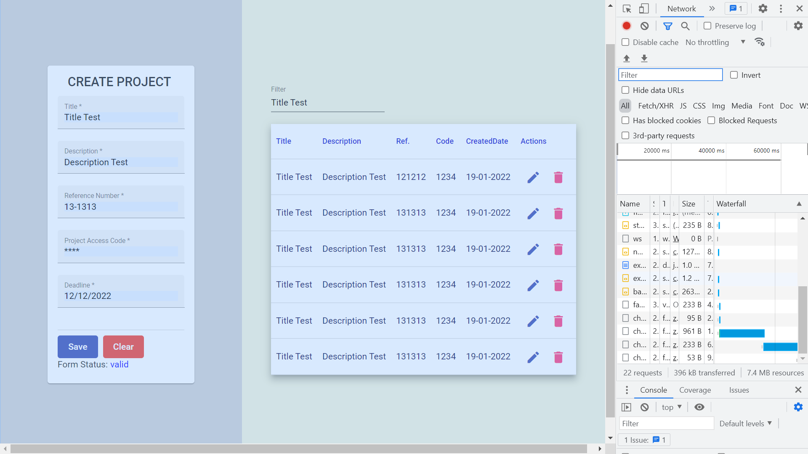

# :zap: Angular Material Firebase

* IN WORK App Creates, Reads, Updates & Deletes (CRUD) data stored in [Google Firebase](https://firebase.google.com/)
* Uses the [Angular Material design library](https://material.angular.io/) components
* **Note:** to open web links in a new window use: _ctrl+click on link_


## :page_facing_up: Table of contents

* [:zap: Angular Material Firebase](#zap-angular-material-firebase)
  * [:page_facing_up: Table of contents](#page_facing_up-table-of-contents)
  * [:books: General info](#books-general-info)
  * [:camera: Screenshots](#camera-screenshots)
  * [:signal_strength: Technologies](#signal_strength-technologies)
  * [:floppy_disk: Setup](#floppy_disk-setup)
  * [:computer: Code Examples](#computer-code-examples)
  * [:cool: Features](#cool-features)
  * [:clipboard: Status & To-Do List](#clipboard-status--to-do-list)
  * [:clap: Inspiration](#clap-inspiration)
  * [:file_folder: License](#file_folder-license)
  * [:envelope: Contact](#envelope-contact)

## :books: General info

* Project data stored

## :camera: Screenshots



## :signal_strength: Technologies

* [Angular v13](https://angular.io/)
* [Angular Material v13](https://material.angular.io/)
* [RxJS v7](https://rxjs-dev.firebaseapp.com/guide/overview)
* [firebase v9](https://www.npmjs.com/package/firebase)

## :floppy_disk: Setup

* Install dependencies using `npm i`
* Add firebase credentials...
* Run `ng serve` for a dev server. Navigate to `http://localhost:4200/`. The app will automatically reload if you change any of the source files.
* Run `ng build` to build the project. The build artifacts will be stored in the `dist/` directory. Use the `--prod` flag for a production build.

## :computer: Code Examples

```typescript
 
```

## :cool: Features

* tba

## :clipboard: Status & To-Do List

* Status: In work
* To-Do: Complete CRUD, add transloco, darkmode, SSR, PWA

## :clap: Inspiration

* [Angular Material Darkmode in 3 Steps](https://zoaibkhan.com/blog/angular-material-dark-mode-in-3-steps/)

## :file_folder: License

* This project is licensed under the terms of the MIT license.

## :envelope: Contact

* Repo created by [ABateman](https://github.com/AndrewJBateman), email: gomezbateman@yahoo.com
